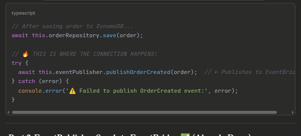

Part 1: Order Service Publishes Event ✅ (Already Done)
Location: services/orders/src/application/use-cases/CreateOrderUseCase.ts

-------------------------------------

Part 2: EventPublisher Sends to EventBridge ✅ (Already Done)
Location: services/orders/src/infrastructure/events/EventPublisher.ts

---------------------------------------------

Part 3: EventBridge Routes to SQS ✅ (Infrastructure)
Location: services/events/template.yaml

This rule says: "When an OrderCreated event from orders.service arrives, send it to the Invoice Generator Queue"
----------------------------------------------------------

Part 4: SQS Queue Holds the Message ✅ (Infrastructure)
Location: services/events/template.yaml

Message format in queue:
{
  "version": "0",
  "id": "event-id",
  "source": "orders.service",
  "detail-type": "OrderCreated",
  "detail": {
    "orderId": "abc-123",
    "userId": "user-456",
    "totalAmount": 99.99,
    "items": [...],
    "shippingAddress": {...}
  }
}

---------------------------------------------------------------
Part 5: Invoice Generator Reads from Queue ✅ (Already Done)
Location: services/invoice-generator/template.yaml

This connects the Lambda to the SQS queue automatically!

----------------------------------------------------------------

Part 6: Lambda Processes Message ✅ (Already Done)
Location: services/invoice-generator/src/handlers/generateInvoice.ts

-------------------------------

🔑 Key Points:
1. Order Service DOESN'T Know About Invoice Generator!
